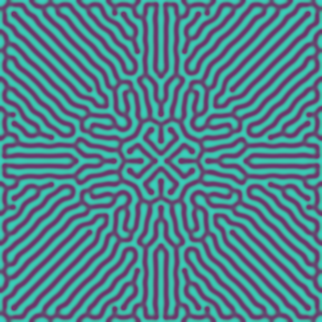
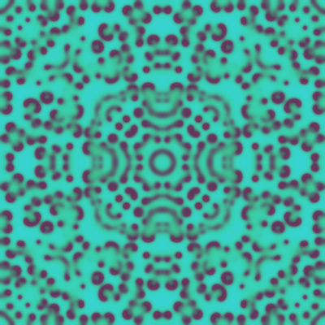
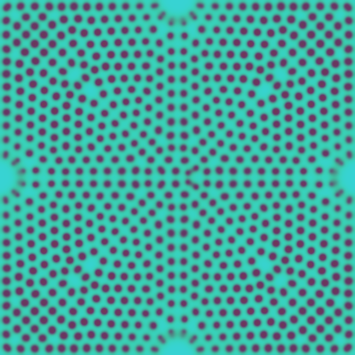

# gs
Reaction Diffusion system calculated from Gray-Scott model on p5.js.

## Demo
OpenProcessing

https://www.openprocessing.org/sketch/553738

## Screenshots
  

## Comments
GPU is not used for calculations, so the framerate may be low.
